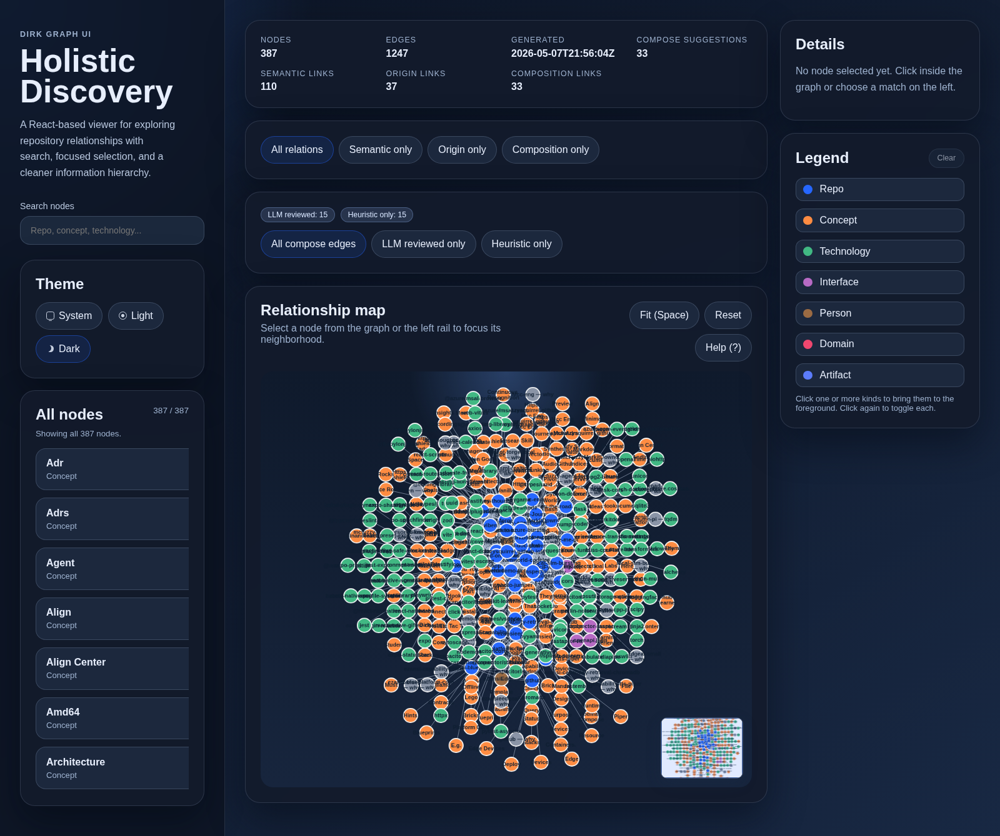
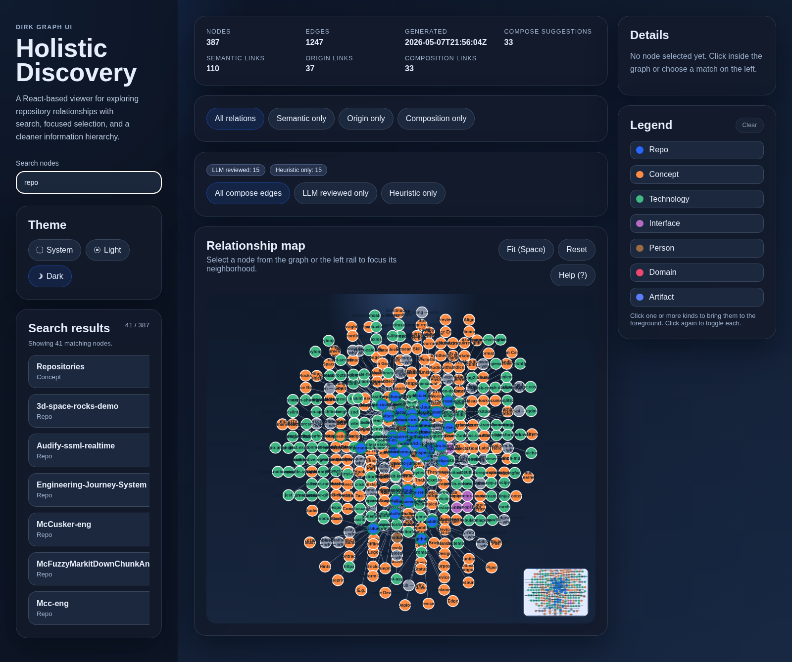
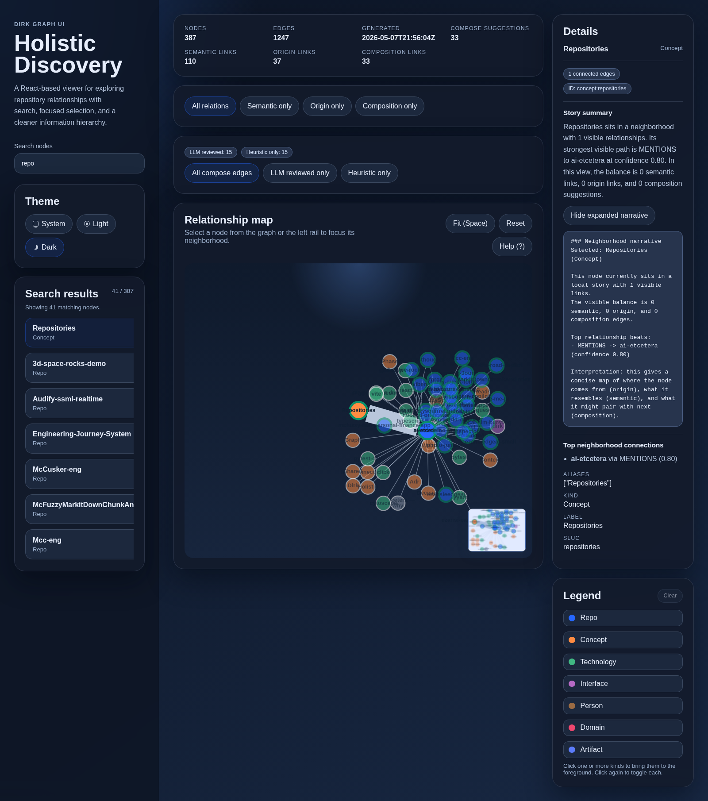
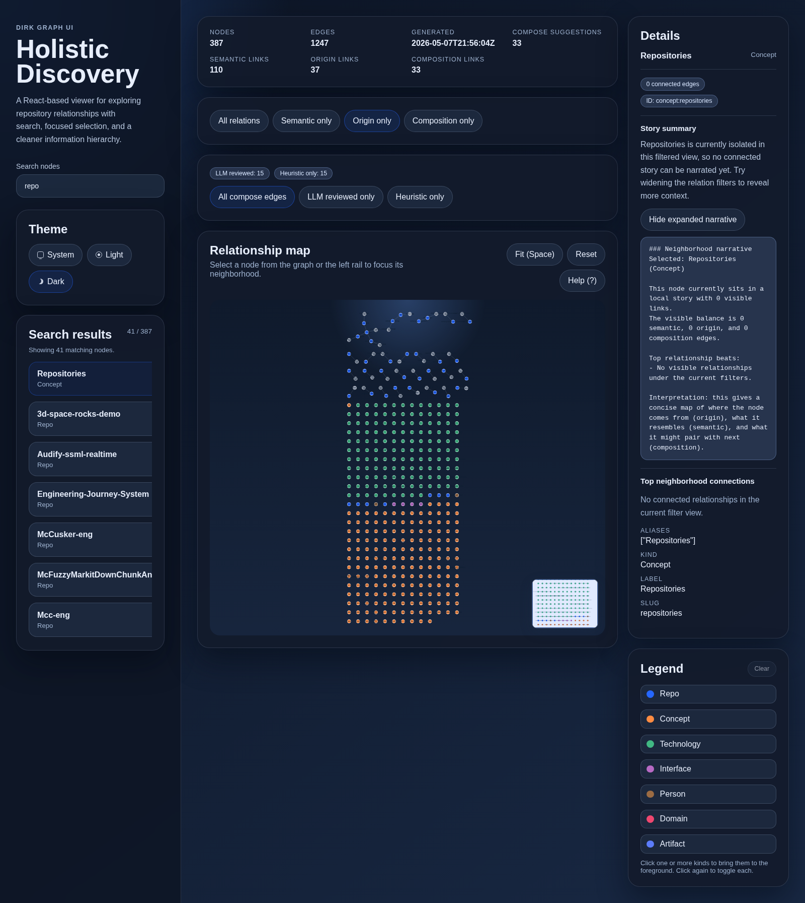
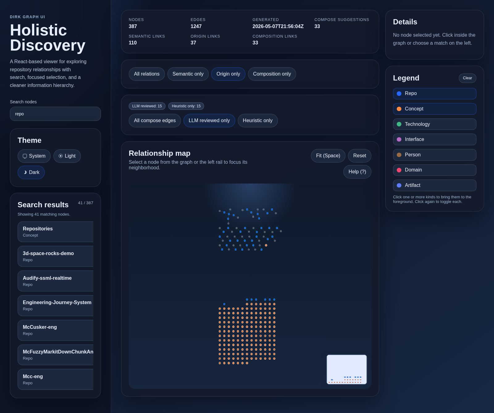
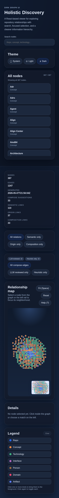
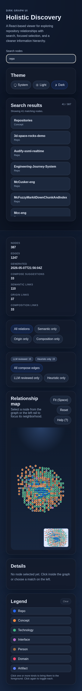

# UI Showcase

Generated with Playwright from the built React graph UI.

Theme: `dark` only.

## Scenes

### 1. Overview dashboard

### 2. Search rail and live results

### 3. Selection details with story summary

### 4. Origin relation filter

### 5. Composition filter (LLM reviewed)

### 6. Legend multi-select spotlight

### 7. Mobile overview

### 8. Mobile search rail

